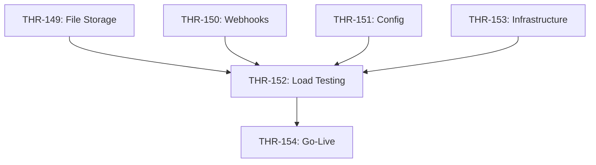

# Developer Guide: Go-Live v1 Implementation

**Epic**: EPIC-7: Go-Live v1
**Goal**: Make Tether Laravel production-ready with stateless architecture
**Timeline**: Dec 30, 2024 → Jan 6, 2026
**Total Story Points**: 42

## Quick Start

1. **Read** [go-live-v1-plan.md](go-live-v1-plan.md) for full technical details
2. **Check your assigned tasks** in Jira under EPIC-7
3. **Ask questions** in team channel before starting
4. **Test thoroughly** - all code changes must have tests
5. **Update Jira** - move tasks to "In Progress" → "Done"

---

## Overview

We're making 3 major changes:

### 1. **Stateless Architecture** (THR-149)
- **Why**: Enable horizontal scaling with multiple API nodes
- **What**: Migrate from local disk storage to MinIO S3
- **Files to change**:
  - `app/Services/FileUploadService.php:157`
  - `app/Jobs/ProcessUploadJob.php:62`
  - File download controllers
- **Test**: `tests/Feature/S3FileUploadTest.php` (new)

### 2. **Fast Async Webhooks** (THR-150)
- **Why**: EMP requires < 100ms response time
- **What**: Move webhook logic to background jobs, add Redis idempotency
- **Files to change**:
  - `app/Http/Controllers/Webhook/EmpWebhookController.php` (refactor)
  - `app/Jobs/ProcessEmpWebhookJob.php` (new)
  - `config/horizon.php` (add webhooks queue)
- **Test**: `tests/Feature/WebhookIdempotencyTest.php` (new)

### 3. **Production Infrastructure** (THR-153)
- **Why**: Deploy to production with load balancer, API nodes, workers
- **What**: Provision and configure all infrastructure
- **Components**: Load Balancer, 2 API nodes, Worker nodes, Redis, MinIO, Postgres+pgBouncer

---

## Task Breakdown

| Task | Owner | Story Points | Priority | Description |
|------|-------|--------------|----------|-------------|
| **THR-149** | Backend Dev | 5 | Critical | File Storage Migration to S3/MinIO |
| **THR-150** | Backend Dev | 8 | Critical | Async Webhook Processing with Idempotency |
| **THR-151** | Backend/DevOps | 3 | Critical | Production Configuration |
| **THR-152** | QA/Backend | 5 | Critical | Load Testing and Performance Validation |
| **THR-153** | DevOps | 13 | Critical | Infrastructure Provisioning and Deployment |
| **THR-154** | Full Team | 8 | Critical | Manual Testing and Go-Live |

---

## Key Files to Review

### Files You'll Modify
```
app/Services/FileUploadService.php         - Change to S3 storage
app/Jobs/ProcessUploadJob.php              - Download from S3, parse, cleanup
app/Http/Controllers/Webhook/EmpWebhookController.php - Refactor for speed
app/Jobs/ProcessEmpWebhookJob.php          - New async webhook processor
config/horizon.php                          - Add webhooks queue
config/filesystems.php                      - Verify S3/MinIO config
.env.example                                - Add production settings
```

### Tests You'll Write
```
tests/Feature/S3FileUploadTest.php         - S3 upload/download integration test
tests/Feature/WebhookIdempotencyTest.php   - Webhook idempotency test
tests/load/webhook-load-test.js            - k6 load test script
```

### Docs You'll Create
```
docs/manual-testing-checklist.md           - Pre-go-live testing checklist
docs/performance-tuning.md                  - Performance optimization guide
```

---

## Critical Requirements

### ✅ All Code Changes Must:
- [ ] Have passing tests (unit + integration)
- [ ] Follow Laravel best practices
- [ ] Include error handling
- [ ] Be reviewed by another developer
- [ ] Update Jira task status when complete

### ✅ Performance Targets:
- [ ] Webhook endpoint: **p95 < 100ms**, **p99 < 200ms**
- [ ] Load test: **100 RPS** with **< 1% errors**
- [ ] Queue workers: Keep up with incoming jobs

### ✅ Security Requirements:
- [ ] No secrets in Git (use .env)
- [ ] File permissions: 600 for .env files
- [ ] Strong passwords (min 16 chars)
- [ ] Private networking for Redis/MinIO/Postgres
- [ ] APP_DEBUG=false in production

---

## Development Workflow

### 1. Pick a Task
- Check Jira EPIC-7 for unassigned tasks
- Start with your assigned priority tasks
- Move task to "In Progress" in Jira

### 2. Implement
- Read [go-live-v1-plan.md](go-live-v1-plan.md) for implementation details
- Follow code examples provided
- Write tests as you code (TDD preferred)
- Test locally with `Storage::fake('s3')` and `Queue::fake()`

### 3. Test
- Run unit tests: `./vendor/bin/phpunit`
- Run integration tests with staging MinIO
- Verify no regressions in existing functionality

### 4. Review
- Create PR with clear description
- Reference Jira task (e.g., "THR-149: Migrate to S3 storage")
- Get code review approval
- Merge to main

### 5. Deploy to Staging
- Deploy to staging environment
- Run smoke tests
- Verify in staging before production

### 6. Update Jira
- Move task to "Done"
- Add comments with any notes or issues encountered

---

## Dependencies



**Critical Path**: THR-153 (Infrastructure) is the longest - DevOps should start immediately

---

## Testing Strategy

### Local Testing
```bash
# Run all tests
./vendor/bin/phpunit

# Run specific test
./vendor/bin/phpunit tests/Feature/S3FileUploadTest.php

# With coverage
./vendor/bin/phpunit --coverage-html coverage/
```

### Staging Testing
1. Deploy code to staging
2. Verify MinIO S3 connectivity
3. Test file upload → process → download flow
4. Test webhook endpoint with real EMP webhooks
5. Run load test with k6

### Production Testing
1. Smoke tests (manual checklist)
2. Load test (k6 script)
3. Monitor for 24 hours

---

## Common Questions

**Q: What is MinIO?**
A: MinIO is an **S3-compatible object storage** server. It's lightweight, easy to deploy, and works exactly like AWS S3 from Laravel's perspective.

**Q: How do I test S3 locally without MinIO?**
A: Use `Storage::fake('s3')` in tests. For manual testing, you can run MinIO locally with Docker: `docker run -p 9000:9000 minio/minio server /data`

**Q: What if webhook response time is still > 100ms after refactoring?**
A: Profile the code, check Redis latency, ensure database queries are optimized, consider PHP-FPM tuning.

**Q: What if load test fails?**
A: Tune Horizon worker counts, PHP-FPM pool size, Redis memory. Document findings in `docs/performance-tuning.md`.

**Q: Who do I ask for help?**
A:
- **Backend questions**: Backend lead
- **Infrastructure/DevOps**: DevOps lead
- **Testing**: QA lead
- **Urgent issues**: Post in team channel

---

## Support Resources

- **Full Technical Plan**: [go-live-v1-plan.md](go-live-v1-plan.md)
- **Epic Overview**: [go-live-v1-epic.md](go-live-v1-epic.md)
- **Jira Epic**: EPIC-7: Go-Live v1
- **Laravel Docs**: https://laravel.com/docs/11.x
- **MinIO Docs**: https://min.io/docs/minio/linux/index.html
- **MinIO S3 API**: https://min.io/docs/minio/linux/developers/s3-sdk.html

---

## Timeline

| Date | Milestone |
|------|-----------|
| **Dec 30-31** | Code changes (THR-149, THR-150, THR-151) |
| **Jan 1-2** | Infrastructure setup (THR-153) |
| **Jan 3-4** | Load testing and tuning (THR-152) |
| **Jan 5** | Final testing and staging validation (THR-154) |
| **Jan 6** | Production deployment and monitoring (THR-154) |

---

## Go-Live Checklist

Pre-deployment:
- [ ] All tests passing
- [ ] Code reviewed and merged
- [ ] Infrastructure provisioned
- [ ] Load test passed on staging
- [ ] Manual smoke tests passed
- [ ] Team briefed and on standby

Post-deployment:
- [ ] Health checks passing
- [ ] Smoke tests passed in production
- [ ] Monitoring active
- [ ] Team monitoring for first 24 hours

---

## Questions?

If anything is unclear:
1. Check [go-live-v1-plan.md](go-live-v1-plan.md) first
2. Ask in team channel
3. Update this guide if you find gaps

**Let's ship this! 🚀**
